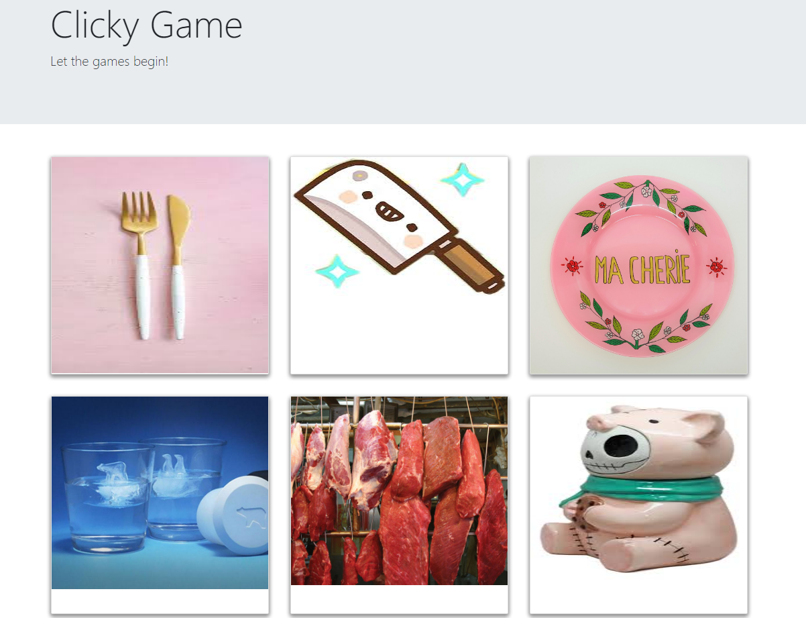
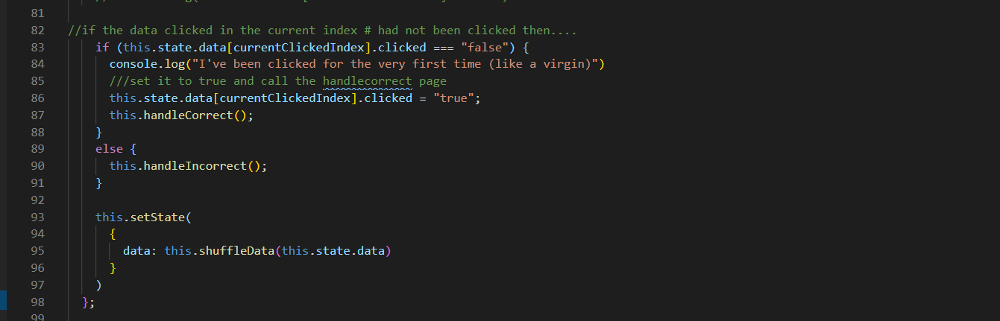
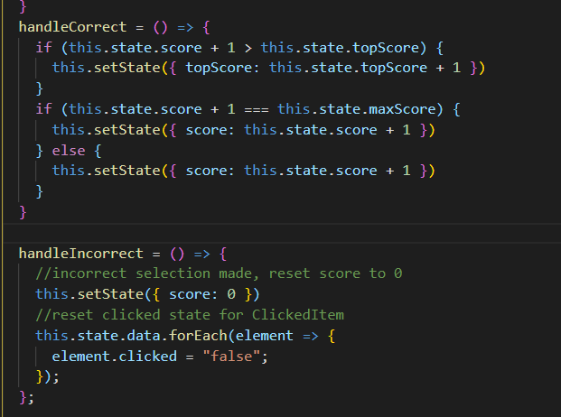

# Clicker Game

### A simple app to help with memory. We all could use it! 

## Table of Contents
* [Technologies Used](Technologies_Used)
* [Deployed Site](Deployed)
* [Features](Features)
* [Usage](Usage)
* [Author](Author)
* [Credits](Credits)
* [License](License)

## Technologies_Used
* HTML 
* CSS
* React js
* github pages

## Deployed Site
[ClickClick!]( https://rksouth.github.io/Clicker-Game/)

## Features 

__1. A Way to keep Score__

*Why?*

Clicky Game is essentially a memory game -a game that can help those who have memory problems to track and improve their skills. So keeping score can be really helpful.

*How?*

Keeping a running score in react isn't very different from vanilla javascript because we want to track what is clicked and do a comparison. If the image hasn't een clicked yet, we want to add to it. If it has then the game is over and the score needs to be reset 

 
__2. Images that Jump around whenever you click__

*Why?*
This adds a level of difficulty to the game that makes it more fun to play.

*How?*

__2. Deployed to Github pages from the terminal__

## Usage
### How do you use this project? This is meant for anyone looking for a more structured approach to exercise and working out. If you are looking to keep an easy to manage website 
 
## Author 
Rachael Kelm-Southworth

* [linkedin](https://www.linkedin.com/in/rachael-kelm-southworth-87a3831b3) 

* [Portfolio](https://rksouth.github.io/Portfolio/ )

* [github](https://github.com/RKSouth/)

 ## Credits

I would like to thank Kerwin, Manuel, Roger, Jerome and all my classmates for helping me understand this subject matter and anyone that contributed to make the base code.

## License
[MIT](https://choosealicense.com/licenses/mit/)

